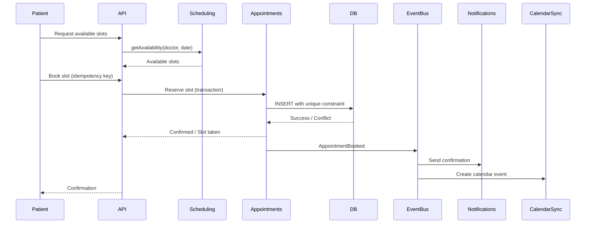

# HospitalFlow — Hospital Appointment & OPD Management Platform
## System Architecture Document

---

## 1. Architecture Style

**Modular monolith.** A single deployable backend service organized into clearly bounded modules (Scheduling, Appointments, Queue, Doctors/Departments, Notifications, Calendar Sync, Billing, Auth/RBAC, Audit). Each module owns its own data access and exposes internal interfaces; modules communicate through well-defined internal APIs, not direct cross-module DB access.

**Why not microservices at MVP:** the core value of HospitalFlow is strong transactional consistency around appointment booking (CONC-001). Splitting scheduling/appointments/queue into separate services at this stage would introduce distributed-transaction complexity for no operational benefit at current scale. A modular monolith gives clean extraction points later without premature network boundaries.

**When to extract a service:** if a specific module's load profile diverges sharply from the rest of the system (e.g., notification fan-out at very high volume, or a future multi-hospital deployment where scheduling logic must be replicated per tenant), that module becomes a strong microservice candidate. Extract when a module needs independent scaling, independent deployment cadence, or a different tech stack — not before.

## 2. Frontend Architecture

Two frontend surfaces sharing a component library:
- **Patient web app** — mobile-first, server-rendered for fast first paint (React with Next.js), optimized for low-friction booking.
- **Staff web app** (doctor/receptionist/admin/billing) — desktop/tablet-optimized single-page app (React + Vite), heavier on real-time updates (queue, dashboards).

Shared design system and API client package between both to avoid duplication.

## 3. Backend Architecture

Single Node.js (TypeScript) backend, organized as a modular monolith:

```
/src
  /modules
    /auth
    /doctors
    /departments
    /scheduling      (working hours, breaks, leave, holidays, slot generation)
    /appointments     (booking, cancel, reschedule, lifecycle)
    /queue            (check-in, tokens, real-time queue state)
    /consultations    (notes, prescriptions, follow-ups)
    /notifications
    /calendar-sync    (Google OAuth, event sync, webhooks)
    /billing
    /audit
  /shared
    /db
    /events           (internal event bus for cross-module notifications)
```

Cross-module communication happens via direct function calls (same process) plus an internal event bus for decoupled side effects (e.g., `AppointmentBooked` event triggers Notifications and Calendar Sync modules without those modules being called synchronously from the booking path).

## 4. Recommended Framework and Language

- **Backend:** Node.js + TypeScript (NestJS) — strong module boundaries out of the box, good fit for a modular monolith, mature ecosystem for auth, queues, and validation.
- **Frontend:** React + TypeScript (Next.js for patient app, Vite SPA for staff app).
- **Justification:** TypeScript end-to-end reduces integration bugs between frontend/backend for a small team; NestJS's module system directly maps to the modular-monolith boundaries defined above.

## 5. Database

**PostgreSQL** (primary datastore).

Justification: strong transactional guarantees and row-level locking are essential for double-booking prevention (CONC-001); mature support for constraints, indexing, and JSON columns where flexibility is needed (e.g., consultation note metadata) without giving up relational integrity for core scheduling data.

## 6. Database Schema / Domain Model (summary)

Core tables: `patients`, `doctors`, `departments`, `doctor_departments`, `staff`, `schedules` (working hours), `breaks`, `leaves`, `holidays`, `slots`, `appointments`, `queue_tokens`, `consultation_notes`, `prescriptions`, `payments`, `notifications`, `calendar_connections`, `audit_logs`.

Key constraints:
- `UNIQUE (doctor_id, slot_start_time)` on active appointments — the core double-booking guard (CONC-001).
- `appointments.status` as an enum matching the lifecycle in SRS FR-170.
- `audit_logs` is append-only (no update/delete permission at the DB role level).

## 7. Caching

Redis for:
- Real-time queue state (fast reads for doctor/patient queue views)
- Session/token caching
- Rate-limiting counters

Postgres remains authoritative; Redis is a performance layer, never the source of truth for appointment state.

## 8. Background Jobs / Queues

Redis-backed job queue (e.g., BullMQ) for:
- Slot generation/regeneration on schedule changes
- Notification sending and retries (NOTIF-005)
- Google Calendar sync operations and retries (CAL-010)
- No-show auto-transition after grace period (EDGE-015)

## 9. File/Object Storage

S3-compatible object storage for any prescription/note attachments (FILE-001), accessed only via short-lived signed URLs with server-side authorization checks — never public buckets.

## 10. API Architecture

REST API, versioned (`/api/v1/...`), organized by module. JSON request/response, consistent error envelope (ERR-001). GraphQL was considered but rejected for MVP — REST is simpler to reason about, cache, and secure for this scope.

## 11. Authentication

- Patients: email/phone + password, JWT access token + refresh token.
- Staff: same JWT scheme with shorter-lived access tokens and stricter session expiry (AUTH-003).
- Google OAuth 2.0 used exclusively for calendar connection (CAL-001), stored as a separate credential scoped to the `calendar-sync` module — never conflated with HospitalFlow login.

## 12. Authorization / RBAC

Role and permission checks enforced in a shared middleware layer at the API gateway/controller level, backed by a permissions table mapped to roles (RBAC-001–007). No endpoint trusts client-supplied role claims without re-validating against the server-side session.

## 13. Session/Token Strategy

Short-lived JWT access tokens (15 min) + rotating refresh tokens stored server-side (revocable), allowing immediate session termination (e.g., account lock, AUTH-005) without waiting for token expiry.

## 14. Appointment Scheduling Engine

A dedicated internal service within the `scheduling` module responsible for:
- Computing available slots from working hours, breaks, leave, and holidays (FR-130)
- Regenerating slots on any relevant change (FR-002)
- Exposing a single `getAvailability(doctorId, dateRange)` interface consumed by both patient and staff frontends, guaranteeing consistent availability logic everywhere.

## 15. Slot-Generation Algorithm

For each doctor, for each day in the rolling window (default 30 days):
1. Start from the day's working-hour shift(s).
2. Subtract configured breaks.
3. Subtract any leave covering that date.
4. Skip entirely if a hospital-wide holiday applies (unless doctor opted to work).
5. Divide remaining time into slots of the doctor's configured slot duration.
6. Mark slots already booked as unavailable.

Regeneration is incremental where possible (only affected date ranges) to avoid recomputing the full window on every change.

## 16. Double-Booking Prevention

Enforced at the database layer via a unique constraint on `(doctor_id, slot_start_time)` for non-cancelled appointments, combined with a transaction that checks-and-inserts atomically (`SELECT ... FOR UPDATE` or a conditional insert). Application-level checks are a UX optimization only — the database constraint is the actual guarantee (CONC-001, EDGE-001).

## 17. Transaction Strategy

Booking, cancellation, and rescheduling are each wrapped in a single database transaction. Rescheduling is implemented as release-old-slot + reserve-new-slot inside one transaction, so a failure at either step rolls back both (FR-160).

## 18. Idempotency Strategy

Client-supplied idempotency keys on booking requests (IDEM-001), stored with a short TTL, so a retried network request returns the original result instead of creating a duplicate. Webhook handlers (calendar, payment) deduplicate by provider-supplied event/transaction ID (IDEM-002/003).

## 19. Google Calendar OAuth Integration

Doctor initiates OAuth consent from their dashboard → HospitalFlow stores refresh token (encrypted at rest) scoped to that doctor → `calendar-sync` module uses it to create/update/delete events via the Google Calendar API. Token expiry/revocation pauses sync for that doctor only and surfaces a reconnect prompt (EDGE-007), without affecting booking.

## 20. Google Calendar Synchronization Architecture

One-way sync: HospitalFlow → Google Calendar. Appointment lifecycle events (`AppointmentBooked`, `AppointmentCancelled`, `AppointmentRescheduled`) are published to the internal event bus; the `calendar-sync` module consumes them asynchronously via the background job queue, so calendar sync never blocks the booking transaction.

## 21. Calendar Webhook Handling

Google Calendar push notifications (webhooks) are used only to detect external changes for informational/reconciliation purposes — never to alter HospitalFlow's appointment state (CAL-011). Each webhook payload's event ID is deduplicated before processing (IDEM-002).

## 22. Notification Architecture

`notifications` module subscribes to appointment/queue lifecycle events on the internal bus and dispatches via pluggable providers (email now, SMS/push post-MVP). Each dispatch attempt is logged; failures retry with exponential backoff up to 3 times before being marked failed (NOTIF-005) without affecting the underlying appointment (ERR-002).

## 23. Real-Time Updates

WebSocket (or Server-Sent Events) channel per doctor's queue and per patient's active appointment, backed by Redis pub/sub, so queue position and status changes propagate to connected clients within the 2-second target (FR-003).

## 24. Search Architecture

MVP: relational queries (indexed columns on doctor name, department, specialization) are sufficient at single-hospital scale. A dedicated search engine (e.g., Elasticsearch) is a post-MVP optimization if doctor/department catalog size grows significantly.

## 25. Payment Integration Architecture

MVP: manual payment status recording by billing staff (BILL-001–003), no live payment gateway. Architecture reserves a `payments` module interface so a gateway (Stripe/Razorpay-style) can be plugged in post-MVP via the same event-driven pattern used for notifications and calendar sync, without touching the booking core.

## 26. Audit Logging

Every sensitive action (appointment state change, schedule change, consultation note access) is emitted as a domain event and persisted to an append-only `audit_logs` table with actor, timestamp, action, and affected entity (SEC-001–002). Audit writes happen synchronously within the same transaction as the action to guarantee no action occurs without a corresponding log entry.

## 27. Security Architecture

Defense in layers: TLS in transit (SEC-010), hashed credentials (SEC-011), server-enforced RBAC (RBAC-007), rate limiting on auth/booking endpoints (SEC-013), and least-privilege database roles (audit log append-only, module-scoped DB users where practical).

## 28. Encryption

TLS 1.2+ for all traffic. Sensitive fields at rest (OAuth refresh tokens, any stored payment references) encrypted using application-layer encryption with keys managed by a secrets manager, not hardcoded.

## 29. Secrets Management

Environment-specific secrets (DB credentials, OAuth client secrets, JWT signing keys) stored in a managed secrets service (e.g., cloud provider's secrets manager), never committed to source control, injected at deploy time.

## 30. Rate Limiting

Applied at the API gateway/middleware layer, keyed by IP + account, with stricter limits on authentication and booking endpoints (SEC-013) to mitigate brute-force and slot-hoarding abuse.

## 31. API Validation

Schema-based request validation (e.g., class-validator/Zod) at the controller boundary for every endpoint, rejecting malformed input with structured error responses before it reaches business logic (API-003).

## 32. Monitoring

Application metrics (booking success/failure rate, API latency, queue depth, notification delivery rate) exported to a monitoring stack (e.g., Prometheus/Grafana or a hosted equivalent), with alerting on booking failure spikes or sync backlog growth (MON-002).

## 33. Logging

Structured JSON logging across all modules, correlation IDs per request for tracing across module boundaries, with sensitive patient data excluded or redacted from log payloads (MON-001).

## 34. Error Tracking

Centralized error tracking (e.g., Sentry-style tool) capturing unhandled exceptions with request context, feeding directly into the monitoring/alerting pipeline.

## 35. Backup and Disaster Recovery

Daily automated Postgres backups with point-in-time recovery enabled (BAK-001); quarterly restore drills (BAK-002); object storage (attachments) backed by provider-native redundancy.

## 36. Deployment Architecture

Single containerized backend service (Docker), deployed behind a load balancer with 2+ replicas for availability; separate static hosting/CDN for the frontend apps; managed Postgres and Redis instances rather than self-hosted, to reduce operational burden for a small team.

## 37. CI/CD

Git-based pipeline: lint → type-check → unit tests → integration tests → build → deploy to staging → manual promotion to production. Database migrations run as a distinct, reviewed pipeline step, never automatically on every deploy without review.

## 38. Environment Management

Three environments: development, staging, production — each with isolated databases and credentials. Staging mirrors production configuration (including a Google Calendar sandbox/test calendar) for realistic pre-release testing.

## 39. Performance Optimization

Indexed queries on hot paths (slot lookup, queue state), Redis caching for read-heavy real-time views, and async processing (job queue) for anything not required to complete within the user-facing request (notifications, calendar sync) to keep booking latency low (PERF-001–002).

## 40. Scalability Strategy

Vertical scaling of the modular monolith plus horizontal replica scaling behind the load balancer covers expected single-hospital load comfortably. The module boundaries defined in §1–3 are the seams along which future service extraction (e.g., for multi-hospital scale) would occur, without requiring a rewrite of the scheduling core.

## 41. Failure Handling

Each external dependency (Google Calendar, notification provider) is isolated behind its own module with its own retry/backoff policy, so its failure never blocks or corrupts the core booking transaction (EDGE-006, EDGE-011). Internal event bus delivery is at-least-once with idempotent consumers.

## 42. Disaster Scenarios

- **Database outage:** managed Postgres failover to standby replica; application returns a clear "temporarily unavailable" state rather than partial/inconsistent booking behavior.
- **Full region outage:** restore from latest backup in a secondary region per DR runbook (tested quarterly per BAK-002).
- **Notification provider outage:** queued jobs retry automatically once the provider recovers; no data loss, only delayed delivery.

## 43. Data Flow Diagrams (text/mermaid)

**Booking flow:**


## 44–48. Critical Request/Response Flows

**Booking flow:** see §43.

**Calendar synchronization flow:** `AppointmentBooked/Cancelled/Rescheduled` event → job queue → `calendar-sync` module calls Google Calendar API → on failure, job retried with backoff (CAL-010); HospitalFlow state is never rolled back due to a sync failure.

**Check-in and queue flow:** Receptionist/patient triggers check-in → `queue` module assigns token, computes position per BR-021 → position pushed via WebSocket/Redis pub-sub to doctor and patient views (FR-190–202).

**Consultation flow:** Doctor starts consultation → appointment moves to `InConsultation`, queue recalculated → doctor completes consultation, adds notes/prescription → appointment moves to `Completed` → doctor may immediately create a follow-up appointment pre-filled with doctor/patient (FR-210–220).

---

**Summary of key architectural decisions:**
- Modular monolith over microservices, with explicit extraction criteria
- PostgreSQL as sole source of truth; Google Calendar strictly a synced projection
- Database-level constraint + transaction as the actual double-booking guard, not application logic alone
- Event-driven side effects (notifications, calendar sync) decoupled from the booking transaction via an internal event bus and background job queue
- Redis used only for performance (cache, real-time, rate limiting), never as authoritative state
